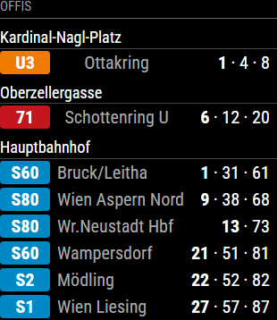

# MMM-ViennaTransit

A [MagicMirror²](https://magicmirror.builders/) module that shows departures for several Vienna public transport stations **in one card, all at once**. It combines:

- **Wiener Linien** live data for U-Bahn, tram and bus
- **ÖBB** timetable data for S-Bahn and regional trains



## Features

- Any number of stations in a single card, no rotating between stations
- Wiener Linien and ÖBB stations can be mixed freely
- One row per line and direction with the next departures, e.g. `U3 Ottakring 1 · 4 · 8`
- Line badges in the official Vienna colours (U1–U6, tram, bus, S-Bahn)
- The minutes count down in the browser between data fetches
- Wiener Linien disruption messages (e.g. `⚠ U3 Verspätungen`) for your U-Bahn lines at the top of the card (Wiener Linien lines only, no ÖBB/S-Bahn disruptions)
- The next departure pulses during the last minute you can still leave to catch it (when it is exactly `minMinutes` away)
- A red ⚠ in the header when a station can't be loaded, even if `hideEmptyStations` hides that station
- 15 s request timeouts; a failing station doesn't affect the others
- If a fetch fails, the last good departures stay on screen (counting down) for a configurable time, with the ⚠ shown

## Installation

```bash
cd ~/MagicMirror/modules
# copy or clone the MMM-ViennaTransit folder here, then:
cd MMM-ViennaTransit
npm install
```

Requires Node.js 20 or newer. The module uses the built-in `fetch` and `AbortSignal.timeout`.

## Configuration

Add the module to the `modules` array in `config/config.js`:

```js
{
	module: "MMM-ViennaTransit",
	header: "Öffis",
	position: "top_left",
	config: {
		stations: [
			{name: "Kardinal-Nagl-Platz", rbl: ["4902"], minMinutes: 4},                         // U3 → Ottakring
			{name: "Oberzellergasse", rbl: ["2044"], minMinutes: 2},                             // 71 → Schottenring
			{name: "Rennweg", oebb: "8101433", products: ["suburban", "regional"], minMinutes: 8}  // S-Bahn
		],
		departuresPerLine:  3,
		updateInterval: 60 * 1000
	}
}
```

### Options

| Option | Default | Description |
|---|---|---|
| `stations` | `[]` | **Required.** List of stations, see below. |
| `departuresPerLine` | `3` | How many departure times per line/direction row. |
| `maxLinesPerStation` | `6` | Maximum rows per station. Rows are sorted by next departure. |
| `hideEmptyStations` | `false` | Leave out stations with no departures (and failed ones; the ⚠ still shows). |
| `shortenDestination` | `22` | Cut destination names after this many characters. `0` = no cutting. |
| `updateInterval` | `60000` | How often data is fetched, in ms. Minimum `30000`. Lower or invalid values are corrected and logged. |
| `oebbWindow` | `90` | How many minutes ahead to request ÖBB departures. |
| `keepLastDataFor` | `300000` | After a failed fetch, keep showing that station's last good departures for this long, in ms. They keep counting down and the ⚠ is shown. After that the station shows "Keine Daten". The same applies to disruption messages. `0` = off. |
| `showDisruptions` | `true` | Show current Wiener Linien disruption messages at the top of the card. Only the newest disruption per line is shown. A disruption disappears when Wiener Linien stops listing it or its end time has passed. If the request fails, the last known messages stay for `keepLastDataFor`. |
| `disruptionLines` | `[]` | Lines to show disruptions for, e.g. `["U3", "U6", "71"]`. `[]` = the U-Bahn lines that run at your configured Wiener Linien stations. Only Wiener Linien lines work here: disruptions come from the Wiener Linien API, so S-Bahn and other ÖBB lines never show any. |
| `pulseLeaveNow` | `true` | Make a line's next departure pulse when it is exactly `minMinutes` away, the last minute to leave for it. |

### Stations

Each station is either a **Wiener Linien** stop or an **ÖBB** station:

| Key | Description |
|---|---|
| `name` | Title shown above the station's rows. |
| `rbl` | Wiener Linien: one RBL number or a list of them, e.g. `["4902", "4909"]`. |
| `oebb` | ÖBB: station ID, e.g. `"8101433"`. |
| `minMinutes` | Hide departures sooner than this many minutes, e.g. your walking time to this stop. Default `0`. |
| `products` | ÖBB only: which train types to show. Default `["suburban", "regional"]`. Possible values: `nationalExpress`, `national`, `interregional`, `regional`, `suburban`, `bus`, `ferry`, `subway`, `tram`, `onCall`. |

A station needs either `rbl` or `oebb`. If it has neither, the error is logged and the station shows "Keine Daten".

## Finding station IDs

### Wiener Linien: RBL numbers

An RBL number identifies **one stopping point**, usually one direction of one line at a station. For both directions of a line you need two RBLs. You can list both in the same station entry.

- Search by station name at <https://till.mabe.at/rbl/>
- Or use the official open data lists: [haltestellen.csv](https://www.wienerlinien.at/ogd_realtime/doku/ogd/wienerlinien-ogd-haltestellen.csv) and [steige.csv](https://www.wienerlinien.at/ogd_realtime/doku/ogd/wienerlinien-ogd-steige.csv)

Note: the Wiener Linien feed has **no S-Bahn data**. Use an `oebb` station for S-Bahn.

### ÖBB: station IDs

Run the included helper from the module folder:

```bash
node find-station.mjs "Wien Meidling"     # search by name
node find-station.mjs 48.1947 16.3863     # stations within 500 m of a coordinate
```

Searching by name doesn't always find the S-Bahn stop. For example, "Wien Rennweg" only returns the tram stop. Searching by coordinate is more reliable. Pick the entry that lists `suburban`:

```
8101433   Wien Rennweg Bahnhst (81 m)  [regional, suburban]
```

## How it works

- `node_helper.js` fetches all stations, waits until that round has finished, then schedules the next one after `updateInterval`, so fetches never overlap. It sends the actual departure times to the browser.
- `MMM-ViennaTransit.js` converts them to minutes and redraws every 20 s. Minutes are rounded down, so a train is never later than shown.
- Data sources:
  - Wiener Linien: `https://www.wienerlinien.at/ogd_realtime/monitor` (official open data, no API key). Wiener Linien asks for fair use: query only the stops you need, no more often than every 15 s. The module's 30 s minimum keeps within that.
  - ÖBB: the HAFAS interface via [`hafas-client`](https://github.com/public-transport/hafas-client). This interface is **unofficial** and may change without notice.

## Known limitations

- A mistyped RBL number looks the same as a stop with no departures, because Wiener Linien replies with an empty list instead of an error.
- Short-turn U-Bahn variants (e.g. `U2Z`) get a grey badge instead of the line colour.
- The module keeps fetching when it is hidden (e.g. by a presence sensor).
- The S-Bahn Stammstrecke between Hauptbahnhof and Praterstern is closed from 7 Sept 2026 until the end of October 2027. Stations on that section (e.g. Rennweg) show no S-Bahn departures until then.

## Acknowledgements

This module was inspired by two existing MagicMirror² modules. No code was copied from them, but the idea and approach came from both:

- **[MMM-WienerLinien](https://github.com/fewieden/MMM-WienerLinien)** by [fewieden](https://github.com/fewieden) (MIT). It showed how to use the Wiener Linien realtime API with RBL numbers for a Vienna departure board.
- **[MMM-PublicTransportHafas](https://github.com/KristjanESPERANTO/MMM-PublicTransportHafas)** by [KristjanESPERANTO](https://github.com/KristjanESPERANTO), initiated by [Ray Wojciechowski](https://github.com/raywo) and originally based on [MMM-PublicTransportBerlin](https://github.com/deg0nz/MMM-PublicTransportBerlin) by [deg0nz](https://github.com/deg0nz) (MIT). It showed how to get ÖBB S-Bahn departures through `hafas-client` and its `oebb` profile.

Also thanks to:

- [hafas-client](https://github.com/public-transport/hafas-client) by the public-transport community (ISC), used for the ÖBB data
- [Wiener Linien Open Data](https://www.wienerlinien.at/open-data), which provides the realtime departures. Data source: Wiener Linien, licensed under [CC BY 4.0](https://creativecommons.org/licenses/by/4.0/)

## License

MIT, see [LICENSE](LICENSE).
